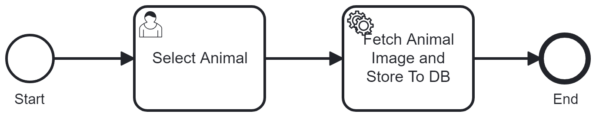

# Camunda Animal Picture App

*Simple application to fetch random animal pictures using Camunda Platform 8.*

This following stack is used:

* Camunda Platform 8
* Java 17
* Spring Boot 3
* Docker
* Kubernetes

# Intro

This application demonstrates a simple process for fetching random pictures of animals (cats, dogs, and bears) based on user selection. It utilizes BPMN to model the process and integrates with external APIs to fetch the images.

The process model includes:

* A user task for selecting the type of animal (cat, dog, or bear)
* A service task to fetch the picture from an external API and store it in an H2 database
  The project includes:

The BPMN process model

* The BPMN process model
* Source code to provide a REST endpoint for clients
* Job worker code to fetch pictures from external APIs and store them in an H2 database
* Docker setup for containerization
* Kubernetes setup for deployment

# How To Run

## Create Camunda Platform 8 Cluster

The easiest way to try out Camunda is to create a cluster in the SaaS environment:

* Login to https://camunda.io/ (you can create an account on the fly)
* Create a new cluster
* Create a new set of API client credentials
* Copy the client credentials into `src/main/resources/application.properties` if you are running it locally, else give the details in `kubernetes/camunda_deployment.yaml`

## Run the Application

### Local Deployment
Run Spring Boot Java Application

The application will deploy the process model during startup:

`mvn spring-boot:run`

### Docker Deployment
You can fetch and run the Docker image directly from Docker Hub:

`docker run -d -p 8888:8888 avispsarc/camunda:latest`

### Kubernetes Deployment
This project is containerized using Docker and can be deployed in a Kubernetes cluster. Follow the steps below to run the application.

Prerequisites

* Docker
* Kubernetes
* Helm

#### Deploy To Kubernetes

1. Create a Kubernetes cluster if you don't have one already.
2. In a terminal, navigate to where you have camunda-deployment.yaml and deploy the application using kubectl
   
    `kubectl apply -f camunda-deployment.yaml`

3. Make sure everything worked by listing your deployments:

   `kubectl get deployments`

#### Helm Chart

Alternatively, you can use a Helm chart to deploy the application. Here's an example Helm chart configuration.

1. Create a Helm chart for the application if you don't have one:
   
    `helm create camunda-animal-picture-app`

2. Update the Helm chart values to match your configuration. Ensure the image name and other configurations are set correctly.
3. Deploy the Helm chart:
   
   `helm install camunda-animal-picture-app ./camunda-animal-picture-app`

## Play

### Local Deployment

You can interact with the application by starting a new process instance and selecting an animal from the task list:

`curl -X GET http://localhost:8888/camunda/avipsa/process/start`

You can now see the process instance in Camunda Operate - linked via the Cloud Console.
You can work on the user task using Camunda Tasklist, also linked via the Cloud Console.

### Docker Deployment

If running via Docker, you can interact with the application in the same way as the local deployment:

`curl -X GET http://localhost:8888/camunda/avipsa/process/start`

### Kubernetes Deployment

If running in Kubernetes, you can expose the service and interact with the application. The default service type is ClusterIP. If you want to expose it externally, you might need to change the service type to NodePort or LoadBalancer.

Once exposed, you can interact with the application:

`curl -X GET http://<external-ip>:32766/camunda/avipsa/process/start`

### Extended Process

There will be some extended process model that adds some more updates to the process soon. 

![Animal Picture App] 

### Credits for the sample data and images

* Cats: https://api.thecatapi.com/
* Dogs: https://place.dog/
* Bears: https://placebear.com

Author: Avipsa Roy Chowdhury

You can find the complete code in repository on GitHub: https://github.com/avipsarc/camundademo